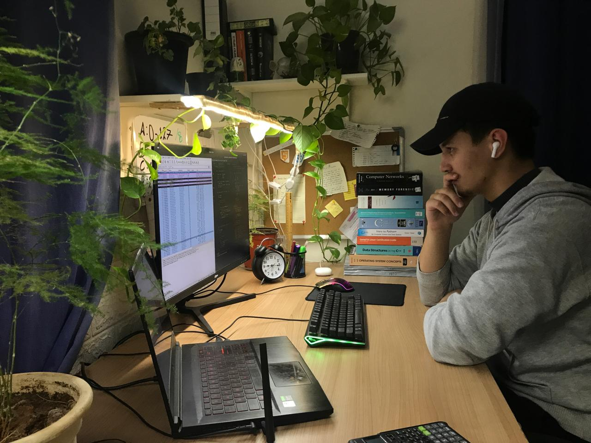

## Hi there 👋

# AlHareth Rayyan's GitHub Portfolio

  

Hi there! I'm **AlHareth**, a computer science student at **ZUJ** and a proud student at **42**, who’s passionate about coding, problem-solving, and learning new technologies. I enjoy tackling real-world projects and am always looking to grow my skills.

## 🚀 About Me

- **Name**: AlHareth Rayyan (Nick name: Victor)
- **Occupation**: Computer Science Student at **ZUJ** and **42**
- **Hobbies**: Coding, competitive programming, open-source projects, learning new languages
- **Languages I Speak**:
  - **Russian**
  - **Ukrainian**
  - **Arabic**
  - **English**
- **Currently Working On**: **CCNA** (Cisco Certified Network Associate) certification

## 🛠️ Skills

### Programming Languages
- **C++**: Comfortable with C++ for algorithmic problem-solving, system programming, and building efficient applications.
- **C**: I have experience working with **C** for system programming and low-level operations.
- **Bash**: Proficient in writing shell scripts to automate tasks and manage Linux systems.
- **SQL**: Experience with **MariaDB** and **PostgreSQL** for basic database management and queries.
- **Python**: Exploring Python for data science, machine learning, and automation.
- **Java**: Just starting out with Java for backend development.

### Web Development
- **HTML/CSS**: Basic knowledge for building static webpages.

### System Programming
- **Linux**: I use **Arch Linux** and work with bash scripting, terminal tools, and system-level programming.
- **CMake**: Familiar with CMake for managing builds in C++ projects.

### Networking
- **CCNA**: Currently studying for the **Cisco Certified Network Associate (CCNA)** certification to deepen my networking knowledge.

### Competitive Programming
- **Problem Solving**: I participate in **Codeforces** and other competitive programming platforms, focusing on algorithms and data structures.

## 📝 Projects

Here are a few projects I've worked on or am still working on:

### 1. **C++ Algorithms & Data Structures**
A collection of basic C++ algorithms and data structure implementations to practice problem-solving skills.

### 2. **Basic Database Management with SQL**
A small project where I use **SQL** to manage data and perform basic CRUD operations.

## 📚 Education

- **Currently studying at ZUJ**, focusing on software engineering and programming fundamentals, including **C++**, **data structures**, and **algorithms**.
- **Currently pursuing CCNA** certification to enhance my networking skills.
- **42 student**: Currently enrolled in **42**, focusing on rigorous hands-on programming challenges and problem-solving.

## 📬 Contact

- **Email**: [b25arbarov@gmail.com](mailto:b25arbarov@gmail.com)

Feel free to check out my projects and contact me if you have any questions or collaboration ideas!
<!--
**VictorRayyan19/VictorRayyan19** is a ✨ _special_ ✨ repository because its `README.md` (this file) appears on your GitHub profile.

Here are some ideas to get you started:

- 🔭 I’m currently working on ...
- 🌱 I’m currently learning ...
- 👯 I’m looking to collaborate on ...
- 🤔 I’m looking for help with ...
- 💬 Ask me about ...
- 📫 How to reach me: ...
- 😄 Pronouns: ...
- ⚡ Fun fact: ...
-->
